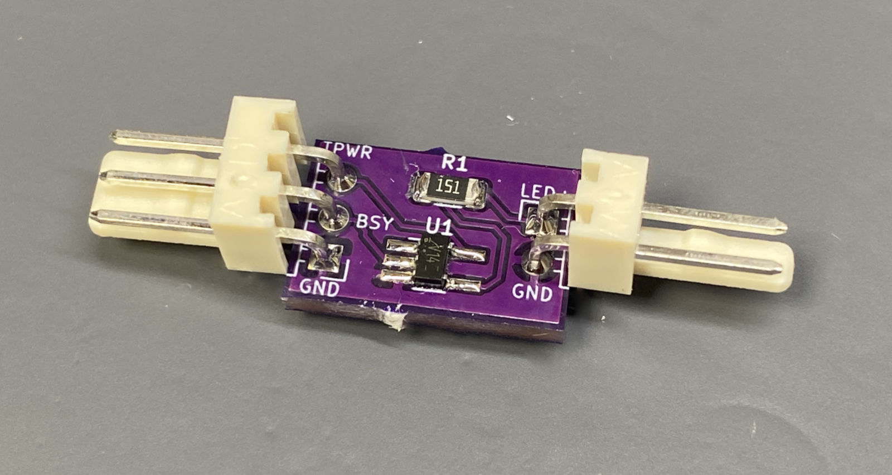
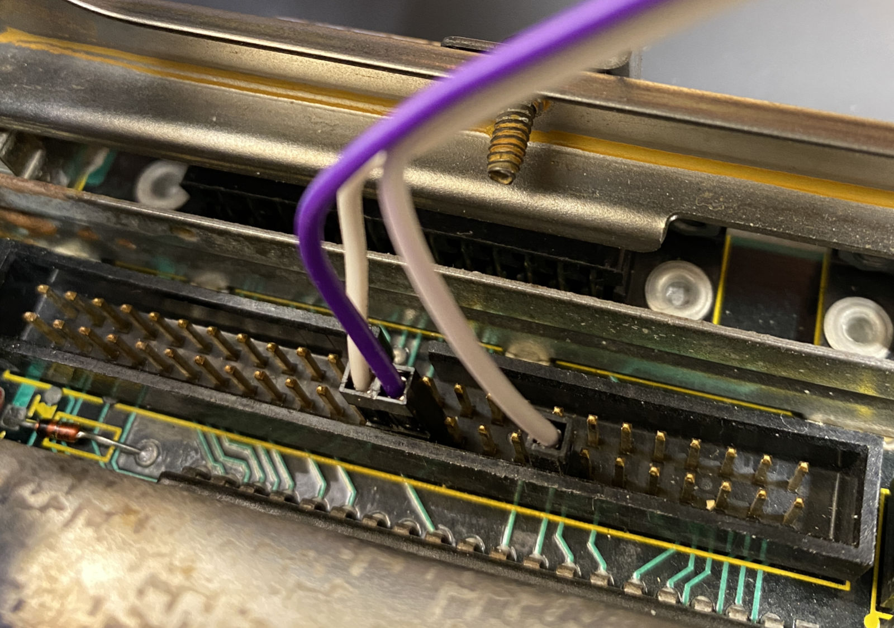
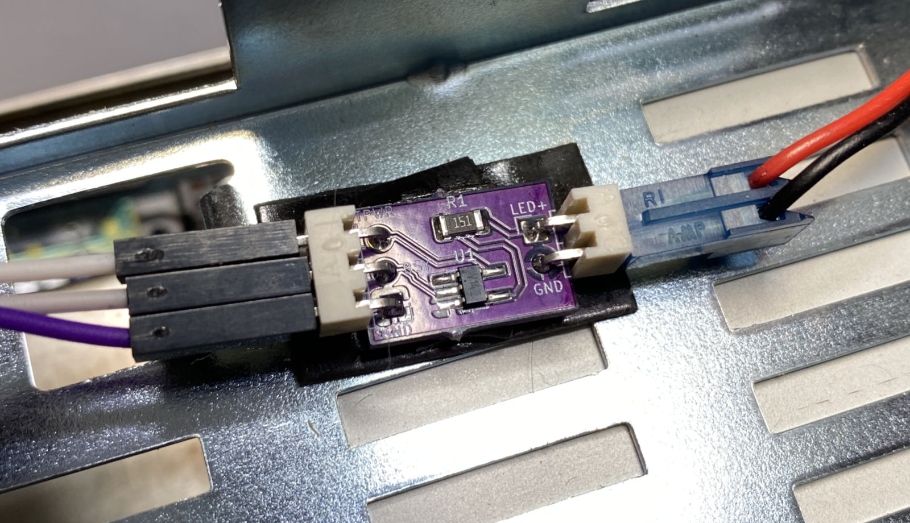
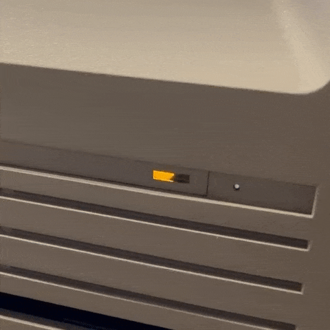

# SCSI activity LED adapter #

Do you use a [BlueSCSI](https://github.com/erichelgeson/bluescsi) externally on your classic Macintosh? Do you wish the little hard drive activity light on the Mac still flashed when using it? This adapter will make that happen.

This adapter has been tested on a Macintosh SE and Macintosh SE/30. Your mileage may vary with other computers.

## Making the board ##

Submit the gerbers under the gerbers/ directory to your favorite PCB manufacturer. I made mine at [OSH Park](https://oshpark.com/shared_projects/9X7GausD). You can order at that link and as of the time of writing this README, it's only $1.20 for three PCBs!

A BOM is in the [bom.csv](bom.csv) file, consisting of:

- 74LVC1G14 Schmitt trigger logic inverter. I've specifically chosen the Nexperia 74LVC1G14GV,125 because the trigger voltages in its datasheet match the best with SCSI logic levels.
- 2- and 3-pin headers. The 2-pin header is keyed so it fits perfectly with the HD LED connector on the Macintosh SE and SE/30 in the proper orientation.
- One 150 ohm 1206 SMT resistor to limit current to the LED.

Soldering the SMT components shouldn't be too hard even if you don't have SMT soldering experience. Just use plenty of flux, place the parts, and touch the pads with a soldering iron coated with solder.

## Connecting the adapter ##

### 1. Connect to the proper SCSI pins ###

Use 3 dupont connectors to connect the adapter to the following pins on the Macintosh's internal SCSI port:

- TERMPWR: pin 26 - provides power to the adapter. Connect to TPWR on the adapter.
- GND: there are lots of ground pins. Just pick one, like pin 28 which is right next to TERMPWR. Connect to GND on the adapter.
- /BSY: this signal is low when the SCSI bus is in use, and high when the bus is free. Connect to BSY on the adapter.

### 2. Connect the HD activity LED ###

This should plug right in if you're using the LED connector on the Macintosh SE and SE/30.

### 4. Watch the blinkenlights! ###

Mount the adapter with some double-sided tape so the bottom doesn't short out on the computer's chassis. Turn it on and hopefully you will have a nicely blinking activity LED!

## TODO ##

- Design a foolproof version of the adapter that plugs directly into a 50-pin internal SCSI connector.

## License ##

[The project license](LICENSE.txt) is under the CERN Open Hardware Licence Version 2 - Permissive.
